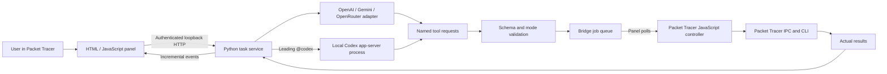

# Architecture

The product combines a JavaScript module inside Packet Tracer with an authenticated Python service on the user's computer. The model proposes named tools; the service validates them and the module executes them against the actual open lab.

## Responsibilities

| File | Responsibility |
| --- | --- |
| `agent.py` | HTTP authentication, task state, mode policy, tool schemas, bridge ownership, execution loop, cancellation, factual continuation summaries, shared model instructions |
| `providers.py` | Private credential storage, model discovery, provider-specific reasoning/tool message formats, bounded transient-error retries |
| `codex_worker.py` | Optional prefix trigger, stdio JSON-RPC lifecycle, dynamic-tool translation, local Codex login, process cleanup |
| `extension/main.js` | Simulator IPC, device/cable/host operations, CLI events, pagination, ping parsing, native dock/resize |
| `extension/ui.js` | Polling, task events, settings, device context, bounded activity rows, lazy rendering |
| `build_extension.py` | Local authenticated `.pts` generation; the output contains a private bridge credential |
| `install_service.py`, `launch.sh`, `install.py` | Linux installation, user systemd lifecycle, desktop launchers and Packet Tracer launch |
| `vendor/pts-codec` | MIT-licensed packer; separate from Cisco's executable |

## One request

1. The service rejects overlapping tasks, invalid mode/context, and empty messages. A leading `@codex` selects the optional worker without saving a different provider.
2. For simulator modes, it obtains fresh native topology/device facts before the user's actual request. Ask has no tools; a selected device can still supply factual context.
3. The provider receives shared instructions, mode, factual history and the current request. Tools are filtered by mode.
4. Each returned tool call is validated again at execution time. Creation is unavailable in Inspect and Plan even if a model requests it anyway.
5. The host handles `set_plan` and bounded `wait_for_network`; other tools enter the bridge queue. A single connected panel owns the bridge.
6. The native controller returns actual output and state. The service feeds those results back to the model and publishes activity events to the UI.
7. A completed model turn ends the task. Errors and interruptions preserve a bounded factual summary for a future continuation. A completed turn does not independently prove that the user's whole network requirement was met: interface, membership and connectivity evidence remain necessary.

## CLI correctness

CLI mode is state: logout, boot dialog, user prompt, privileged prompt, configuration prompt and pager require different input. Each dependent command must wait for the preceding result.

Native status `0` is insufficient: output may contain a wizard rejection or CLI error. The controller checks error text and reports timeouts as unknown. Ping passes only with a complete successful summary. An unfinished ping can occupy a PC terminal after a timeout; inspect and cancel that ping before issuing another command.

Long reads advance `--More--` at most 40 pages within the 25-second CLI bound. Fresh-output extraction avoids interpreting an old terminal summary after history rotation. The bridge itself waits at most 40 seconds for a simulator tool. A timeout after dispatch can mean an action executed without its result arriving; inspect before retrying a mutation.

## State and limits

One active task and one bridge owner are supported. A heartbeat becomes stale after 15 seconds. A task has a configurable 4–80 model-step limit. Completed runs are retained up to 30; conversation/run state lives in memory and disappears on service restart. Retained results inside a run and overall backend memory are not globally byte-capped yet.

The UI requests up to 50 new events per cursor read. It formats details when opened, defers hidden device cards, and keeps approximately 120 closed tool rows while retaining opened rows and conversation text. That controls accumulated UI work; it does not guarantee constant memory usage or native Packet Tracer latency.

## Trust boundaries

The bridge binds to `127.0.0.1:54123`, validates Host and requires a random bearer credential. Packet Tracer custom origins need special CORS handling. CORS is not authentication. Other software running as the same user may be able to read local files or credentials; this is a local-user boundary, not protection from a compromised account.

Device names, model outputs, CLI output and topology text are untrusted data. The extension runs named handlers rather than arbitrary model JavaScript. The CLI denylist blocks exposed destructive/file operations, but Agent mode intentionally permits broad IOS configuration. This is not a complete semantic IOS policy engine.

Model instructions improve decisions; permission checks, timeout handling and execution evidence are the enforceable controls. Instructions cannot fix missing Cisco privileges, provider entitlement or inference quota.

## Session context

`context_memory.py` records the first request and up to 12 recent turns, bounded to 68 KB of serialized factual context. It keeps requests, plans, actual tool arguments/results and labeled assistant claims; oversized observations and omitted turns are explicit. Native provider history remains intact during a tool round trip. Between completed turns, history above 100 KB compacts into this neutral memory, which also transfers across provider/model switches and the headless Codex path.

The automatic full topology baseline is acquired once per session/panel instance; an explicitly selected device gets a fresh targeted read. Follow-ups reuse historical context and are instructed to check affected state before dependent changes. A manually loaded lab in the same panel cannot currently be detected automatically: request Refresh/start New chat, and never treat retained topology as current verification. New chat and service restart clear memory. It is not a durable disk journal.
